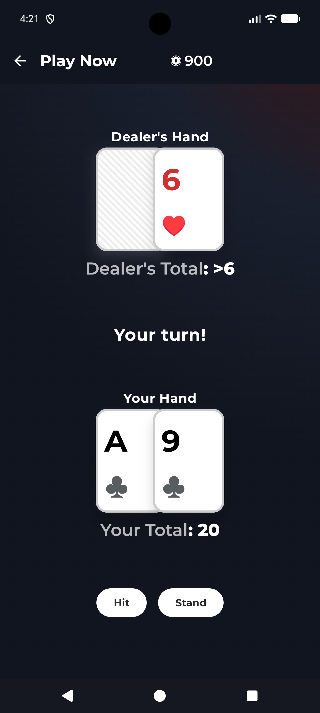

#  BlackJack Android
## A native Android application for playing Blackjack.

### Introduction

This app is a clean, native Android implementation of the classic game of Blackjack. It was built using modern Android development practices, and heavily inspired by [Offsuit](https://www.offsuit.app/). 

I created this project to provide a simple, ad-free gaming experience and to explore the latest capabilities of the Android ecosystem.

**Note:** I am a hobbyist developer and this project is a work in progress. While I strive for a stable experience, you may encounter occasional bugs. If you have suggestions or find issues, please feel free to reach out!

## Screenshots

|                        Home Page                         |                        Play Now                         |                        Multiplayer                         |                        Profile                         |
|:--------------------------------------------------------:|:-------------------------------------------------------:|:----------------------------------------------------------:|:------------------------------------------------------:|
|  |  |  |  |

### Requirements
* **Android Studio Jellyfish or newer.**
* **JDK 17+.**

### Credits

This app used the following open-source libraries and/or code inspired from these projects.

- [Jetpack Compose](https://developer.android.com/jetpack/compose)
- [Material 3](https://m3.material.io/)
- [Navigation 3](https://developer.android.com/guide/navigation/navigation-3)
- [Compose Unstyled](https://composables.com/compose-unstyled)
- [AppCompat](https://developer.android.com/jetpack/androidx/releases/appcompat)
- [Kotlinx Serialization](https://github.com/Kotlin/kotlinx.serialization)
- [MaterialKolor](https://github.com/jordond/MaterialKolor)
- [Haze](https://github.com/chrisbanes/haze)
- [Google Fonts](https://fonts.google.com/)
- [PiFire-Android](https://github.com/weberbox/PiFire-Android)


### Licensing

This project is licensed under the GNU GPLv3 license.

```
BlackJack Android - Android app for playing the classic game of Blackjack


Copyright (c) 2025-2026 Max Weber

This program is free software: you can redistribute it and/or modify
it under the terms of the GNU General Public License as published by
the Free Software Foundation, either version 3 of the License, or
(at your option) any later version.

This program is distributed in the hope that it will be useful,
but WITHOUT ANY WARRANTY; without even the implied warranty of
MERCHANTABILITY or FITNESS FOR A PARTICULAR PURPOSE.  See the
GNU General Public License for more details.

You should have received a copy of the GNU General Public License
along with this program.  If not, see <https://www.gnu.org/licenses/>.
```